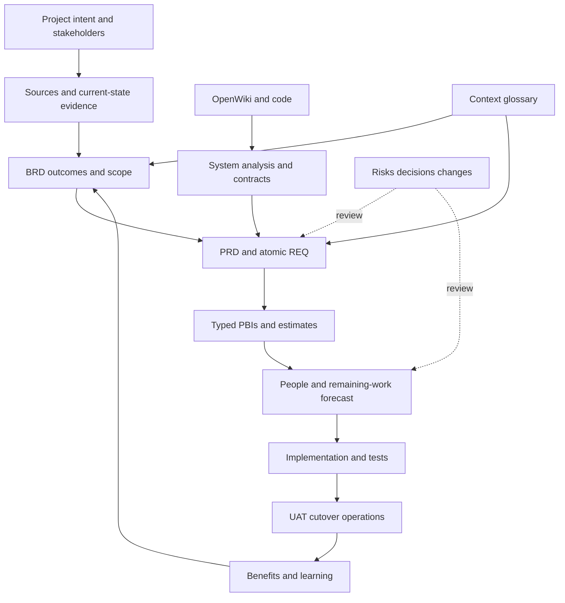

# Project management lifecycle

Advance by business scenario or vertical outcome. Keep distant work coarse and refine near-term work until it is understandable, estimable and testable.

| Stage | Agent artifacts | Accountable decision | Exit evidence |
|---|---|---|---|
| Discovery | Interviews, current/target workflow, value options | Sponsor/business owner sets outcomes; PO orders work | Goals, owner, scope and measurement plan |
| Requirements | BRD, PRD, REQ, evidence and terminology | Business, product and technical owners decide trade-offs | Verifiable near-term needs and explicit unknowns |
| Design | Repository impact, contracts, data and state rules | System/data owners confirm interfaces | Normal/error/recovery behavior and responsibilities |
| Planning | Work slices, assumptions, dependencies and forecast | Team estimates; TPM integrates capacity | Capacity, external windows and deadlines reviewed |
| Iteration | Work updates, test evidence, risks and variance | Team checks AC/DoD; PO inspects outcome | Usable increment and explicit unfinished work |
| Release | UAT, cutover, rollback, reconciliation and handover | Business accepts; release owner decides deployment | Acceptance and executable operations plan |
| Benefits | Adoption, outcome measures and cost variance | Business owner chooses further improvements | Actual benefits inform the backlog |

Review sources when new material arrives; review impact/coverage/quality after changes; recalculate plan when effort or capacity changes. Weekly, review open risks, issues, decisions and actions. Each Sprint, update remaining availability and effort. Each release, review test/UAT/data/cutover/operations evidence and the later measurement window. External communication stays within user authorization.

Done, business acceptance and actual release are separate events. Define appropriate team readiness/baseline practices without adding unnecessary per-item sign-offs. All artifacts follow [Language Policy](../90_Agent/Language-Policy.md) and the [OKF profile](../90_Agent/OKF-Profile.md).
