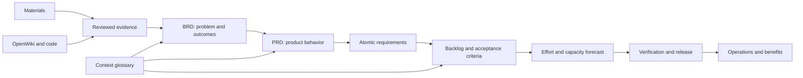

# Agent PM Framework

An Obsidian-compatible workspace for agent-assisted management of internal systems and integration projects. It connects source materials and repository evidence to business requirements, product requirements, backlog items, staffing forecasts, verification and release decisions.

This repository contains reusable procedures, Skills, templates, local tools and tests. Project-specific folders start empty; no demonstration requirements, people, schedules, snapshots or execution records are included.

## Start a project

1. Copy or clone the entire repository, including `.agents` and `.obsidian`, into a dedicated project workspace. Open that folder as an Obsidian Vault and start at [HOME](HOME.md).
2. Follow [Project setup](00_Governance/Project-Setup.md) to set the project ID, owners, scope and decision rights. Complete only facts confirmed for the real project.
3. Set `document_language` in [Settings](00_Governance/Settings.md). Framework documentation, filenames and agent instructions are English. Project documents use the selected language; English is the starter default.
4. Give an agent this workspace and ask it to read [AGENTS](AGENTS.md) and the [workflow Skill](.agents/skills/pm-workflow/SKILL.md). Skills are local adapters; host discovery depends on the agent application. See [Working with agents](90_Agent/Working-with-Agents.md).

## Workflow



Use the [workflow](00_Governance/Workflow.md) for stage criteria and ownership. Evidence, baseline decisions and acceptance results remain separate records. Agent drafts and structural validation do not constitute business approval or a team commitment.

## Local tools

Python 3.10+ and Git are required. Tools run locally without calling a model or executing registered repository code.

```sh
python3 -m venv .venv
.venv/bin/python -m pip install -r requirements.txt
.venv/bin/python tools/pm.py settings
.venv/bin/python tools/pm.py validate
.venv/bin/python -m unittest discover -s tests -v
```

On Windows, use `.venv\Scripts\python.exe` in place of `.venv/bin/python`. PDF extraction additionally requires `requirements-pdf.txt`. See [the tool manual](tools/README.md) for commands and exit codes.

A fresh workspace reports `PROJECT_SETUP` until the charter is configured. Forecasting is blocked until the forecast date, iterations and allocations are supplied. Generated reports and imported project data belong to the project copy; they are not framework release artifacts.

## Language and knowledge format

Project language is configurable independently of conversational language. The deterministic tools include English and Traditional Chinese catalogs; other languages require a reviewed catalog. Original evidence and immutable baselines retain their original bytes. See [Language settings](00_Governance/Language-Settings.md).

The [OKF profile](90_Agent/OKF-Profile.md) applies to authored knowledge. Native Skill files retain the host format, while `okf-export` produces a separate portable knowledge bundle with typed Skill representations and standard Markdown links. It is a knowledge export, not a replacement executable workspace.

## Development

Tests create synthetic records in temporary directories and remove them afterward. They cover source preservation, planning, baseline integrity, traceability, language settings, exports and clean-workspace behavior. They do not certify agent reasoning or business readiness. Use the [evaluation method](90_Agent/Evals/Evaluation-Method.md) for actual agent outcomes.
